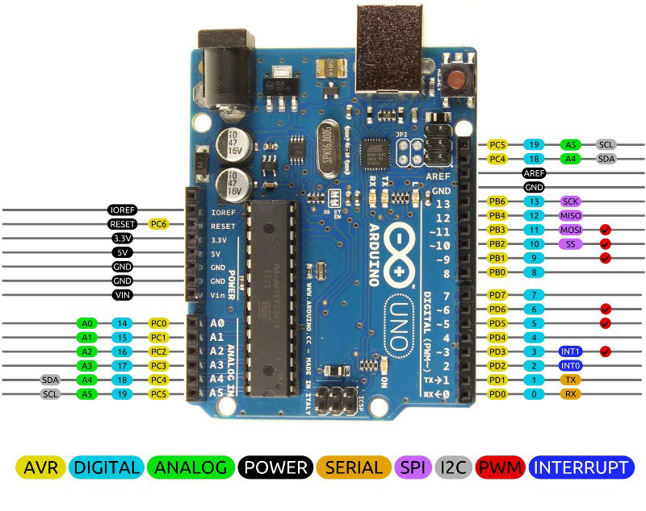
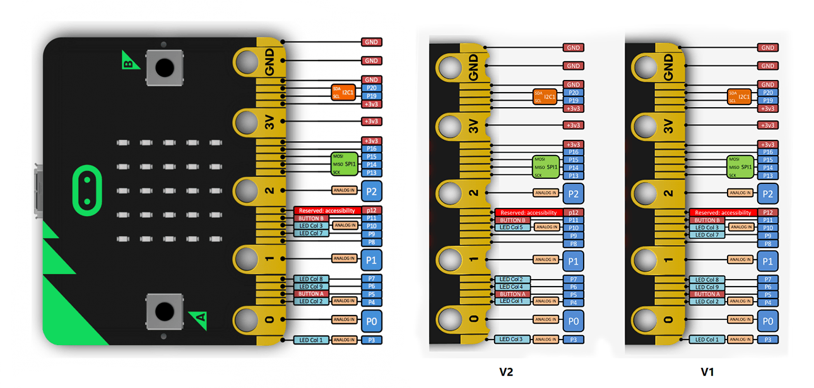
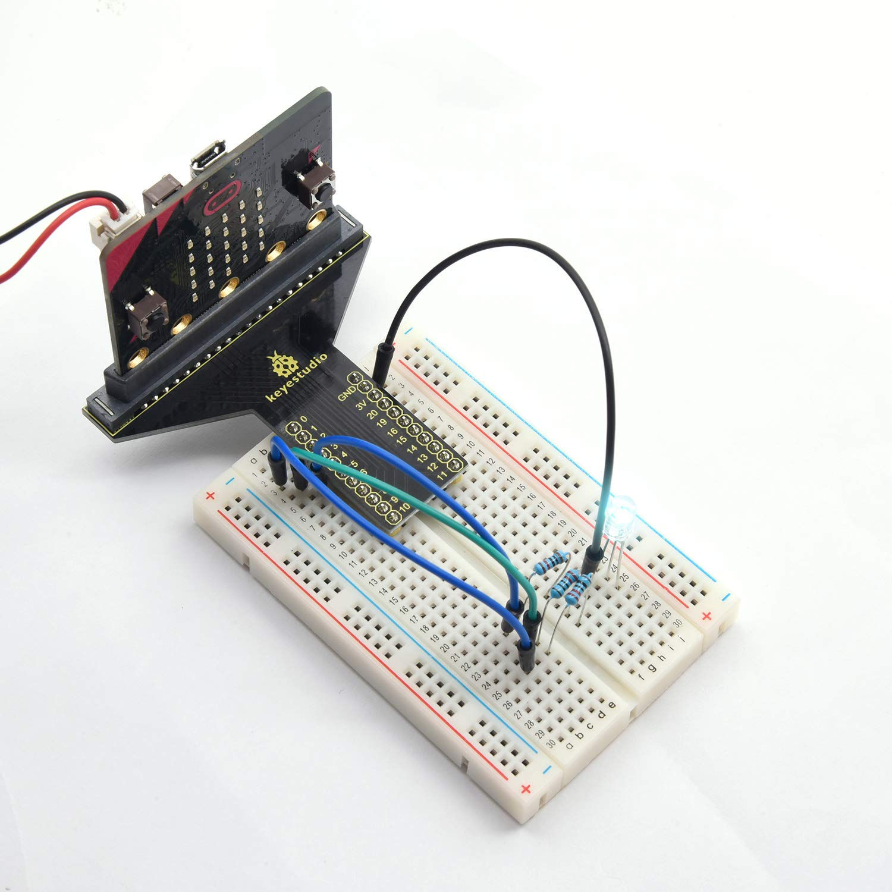
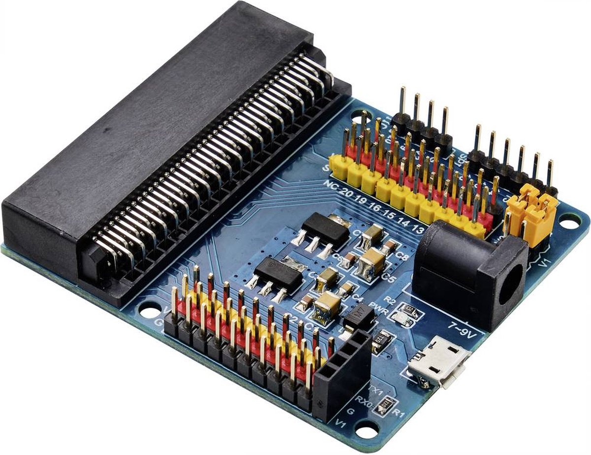
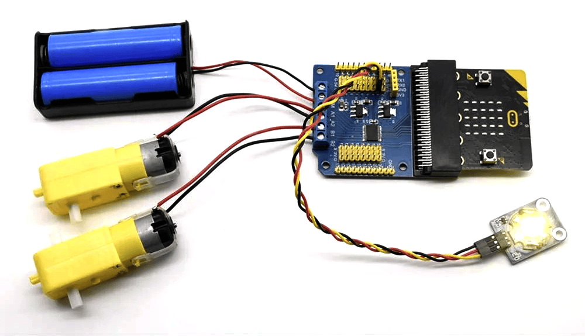
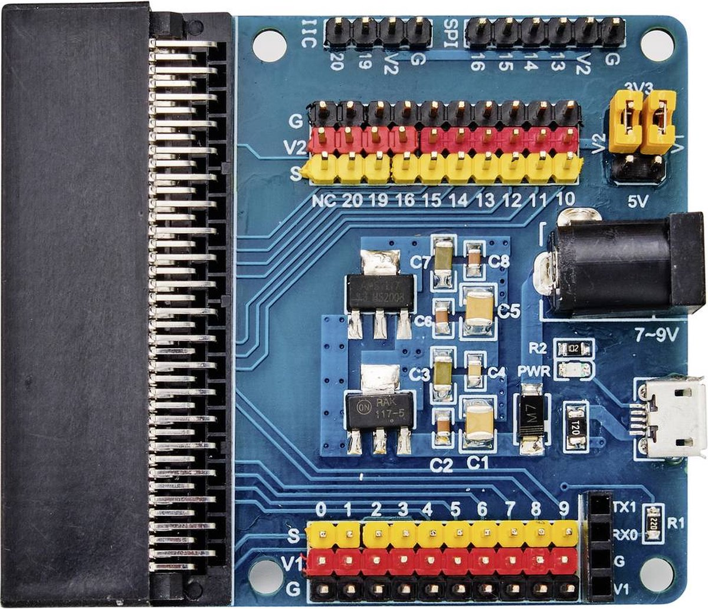

# Micro:bit uitbreiden met pinnen
### Verander de Micro:bit in een Arduino of Makey Makey

https://github.com/CMD-Groningen/microbit-uitbreiden-met-pinnen/assets/5694412/1db22cac-5a21-40f8-b2c6-d2d7c5012b52

In deze tutorial zit een werkend voorbeeld van hoe je een HTML pagina met interface elementen of andere content daarin (animaties, audio, video) kan bedienen of besturen met externe hardware, zoals fysieke knoppen, sliders of sensoren. We doen dit met een Micro:bit waarvan we de contactpunten uitbreiden. Hieronder staan de stappen die je kunt volgen om je project werkend te krijgen. Volg deze instructies om de bestanden te openen, te testen in de browser en de Micro:bit code te downloaden naar de Micro:bit met de aangesloten **Tru Components TC-9072548 breakout board** (hieronder meer daarover)

## Voorkennis
Als je dacht dat alleen Arduino's een heleboel pinnen hadden om hardware op aan te sluiten... De Micro:bit heeft er net zoveel, 22 pinnen! En het voordeel van de Micro:bit is ook nog eens dat er al veel hardware op zit die je als input kan gebruiken, zoals Bluetooth, bewegingssensoren, een speaker, compas, en een microfoon. En het heeft een veel simpelere editor.

### Arduino Uno


### Micro:bit


## Breakout boards

door een breakout board aan een microbit te klikken kunnen we bij deze 22 inputs. De pinnen voor deze inputs zitten dan op dit breakoutboard ook wel penmodule genoem. Voor dit project gebruikte ik de **Tru Components TC-9072548 Sensormodule** maar je kunt elk geschikte beakoutboard hiervoor gebruiken. Er zijn breaout boards in verschillende soorten en maten voor de Micro:bit, sommige van hen kun je drukken op een breadboard om jumper kabels in te steken.



Voor deze tutorial heb ik zelf de Tru Components TC-9072548 Sensormodule gebruikt om de Micro:bit uit te breiden met pinnen. Hier liggen er ook een heleboel van bij de MakerSpace.




## Benodigdheden:

- Een editor, bijvoorbeeld VSCode
- een Micro:bit
- een Tru Components TC-9072548 Sensormodule (pinnenbord)
- Micro USB-kabel
- 3 werkbestanden (een HTML, CSS en JavaScript bestand)
- als je dit project dowload, zitten deze bestanden al in de folder **pinnen-voorbeeld**)!!
- de HEX file met de code voor de Micro:bit


## 1. Voorbereiding

Download de folder **pinnen-voorbeeld** naar je laptop. Daar zitten de 3 bestanden al in die je nodig hebt (HTML, CSS en JavaScript) Of je maakt zelf een folder aan op je latop en plaats daar onderstaande bestanden in:

1. **HTML Bestand**:

Maak een nieuw bestand in je project map genaamd **index.html** en plak de volgende code erin:

```html
     html
     Copy code
     <!DOCTYPE html>
     <html lang="en">
     <head>
         <meta charset="UTF-8">
         <meta http-equiv="X-UA-Compatible" content="IE=edge">
         <meta name="viewport" content="width=device-width, initial-scale=1.0">
         <link rel="stylesheet" href="style.css">
         <title>Test voor Microbit slider</title>
     </head>
     <body>
         <section class="een" id="een">1</section>
         <section class="twee" id="twee">2</section>
         <section class="drie" id="drie">3</section>
         <section class="vier" id="vier">4</section>
         <section class="vijf" id="vijf">5</section>
     </body>
     <script src="javascript.js"></script>
     </html>
```

2. **CSS Bestand**:

Maak een nieuw bestand in de project map genaamd **style.css** en voeg je CSS vormgeving toe:

```CSS
body {
    margin: 0;
    overflow: hidden;
}

.een {
    background: purple;
}

.twee {
    background: orange;
}

.drie {
    background: green;
}

.vier {
    background: darkred;
}

.vijf {
    background: darkcyan;
}

section {
    width: 100vw;
    height: 100vh;
    font-size: 300px;
    font-family: sans-serif;
    font-weight: bold;
    color: white;
    display: grid;
    align-items: center;
    justify-content: center;
}

/* De button om toestemming te verlenen voor de USB poort */
button {
    position: fixed;
    top: 10px;
    right: 10px;
    padding: 10px;
    font-size: 20px;
    font-family: sans-serif;
    font-weight: bold;
    background: white;
    border: none;
    cursor: pointer;
}
```

3. **JavaScript Bestand**:

Maak een nieuw bestand in je project map genaamd **javascript.js** en plak de volgende code erin:

```javascript
     javascript
     Copy code
     // Define a function to handle key events
     function handleKey(eventKey) {
         const een = document.getElementById("een");
         const twee = document.getElementById("twee");
         const drie = document.getElementById("drie");
         const vier = document.getElementById("vier");
         const vijf = document.getElementById("vijf");
     
         if (eventKey === "L") {
             een.style.display = "grid";
             twee.style.display = "none";
             drie.style.display = "none";
             vier.style.display = "none";
             vijf.style.display = "none";
         } else if (eventKey === "R") {
             een.style.display = "none";
             twee.style.display = "grid";
             drie.style.display = "none";
             vier.style.display = "none";
             vijf.style.display = "none";
         } else if (eventKey === "U") {
             een.style.display = "none";
             twee.style.display = "none";
             drie.style.display = "grid";
             vier.style.display = "none";
             vijf.style.display = "none";
         } else if (eventKey === "D") {
             een.style.display = "none";
             twee.style.display = "none";
             drie.style.display = "none";
             vier.style.display = "grid";
             vijf.style.display = "none";
         } else if (eventKey === "W") {
             een.style.display = "none";
             twee.style.display = "none";
             drie.style.display = "none";
             vier.style.display = "none";
             vijf.style.display = "grid";
         }
     }
     
     // Add event listener to handle keydown events
     document.addEventListener("keydown", function (event) {
         handleKey(event.key.toUpperCase());
     });
     
     // Check if the Web Serial API is supported
     if ("serial" in navigator) {
         const connectButton = document.createElement("button"); // Create a connect button
         connectButton.textContent = "Micro:bit linken"; // Set button text
         document.body.appendChild(connectButton); // Append button to the document body
     
         async function connect() {
             try {
                 const port = await navigator.serial.requestPort();
                 await port.open({ baudRate: 115200 });
     
                 console.log("Er is verbinding met de micro:bit!");
     
                 const decoder = new TextDecoderStream();
                 const inputDone = port.readable.pipeTo(decoder.writable);
                 const inputStream = decoder.readable;
     
                 const reader = inputStream.getReader();
                 let buffer = "";
     
                 while (true) {
                     const { value, done } = await reader.read();
                     if (done) {
                         console.log("Serial poort gesloten");
                         break;
                     }
     
                     if (value) {
                         // Append received data to buffer
                         buffer += value;
     
                         // Process buffer to extract complete lines
                         let newlineIndex;
                         while ((newlineIndex = buffer.indexOf("\n")) !== -1) {
                             const completeLine = buffer.substring(0, newlineIndex).trim();
                             buffer = buffer.substring(newlineIndex + 1);
     
                             if (completeLine) {
                                 console.log("Ontvangen data van micro:bit:", completeLine);
                                 handleKey(completeLine);
                             }
                         }
                     }
                 }
             } catch (error) {
                 console.error("Er is een probleem met het aanroepen van de micro:bit: ", error);
             }
         }
     
         connectButton.addEventListener("click", connect);
     } else {
         console.log("Web Serial API wordt niet ondersteund door deze browser.");
     }
```


## 3. Micro:bit Voorbereiden

- **Verbind de Micro:bit** met je computer via een Micro USB-kabel.
- open de Micro:bit MakeCode editor en maak een nieuwe project aan
- Open de HEX file genaamd **microbit_pinnen_lezen_slider.hex** in de Micro:bit MakeCode editor (door hem te slepen in het venster)
- Dezelfde code van de HEX file staat ook hieronder. Je kan hem ook kopieren en plakken in de microbit editor!
- Download daarna de code naar je Micro:bit!
- Ontkoppel de Micro:bit door the klikken op "ontkoppel micro:bit rechts onderin de editor.

``` javascript
let currentStateP9 = 0
let currentStateP8 = 0
let currentStateP2 = 0
let currentStateP1 = 0
let currentStateP0 = 0

// sends the microbit output to USB
serial.redirectToUSB()
// Configure the pins with internal pull-up resistors
pins.setPull(DigitalPin.P0, PinPullMode.PullUp)
pins.setPull(DigitalPin.P1, PinPullMode.PullUp)
pins.setPull(DigitalPin.P2, PinPullMode.PullUp)
pins.setPull(DigitalPin.P8, PinPullMode.PullUp)
pins.setPull(DigitalPin.P9, PinPullMode.PullUp)

// Variables to store the last button states
let lastStateP0 = 1
let lastStateP1 = 1
let lastStateP2 = 1
let lastStateP8 = 1
let lastStateP9 = 1

basic.forever(function () {
    currentStateP0 = pins.digitalReadPin(DigitalPin.P0)
    currentStateP1 = pins.digitalReadPin(DigitalPin.P1)
    currentStateP2 = pins.digitalReadPin(DigitalPin.P2)
    currentStateP8 = pins.digitalReadPin(DigitalPin.P8)
    currentStateP9 = pins.digitalReadPin(DigitalPin.P9)

    if (currentStateP0 == 0 && lastStateP0 == 1) {
        basic.showString("L")
        serial.writeString("" + ("L\n"))
        basic.pause(300)
        basic.clearScreen()
    }
    if (currentStateP1 == 0 && lastStateP1 == 1) {
        basic.showString("R")
        serial.writeString("" + ("R\n"))
        basic.pause(300)
        basic.clearScreen()
    }
    if (currentStateP2 == 0 && lastStateP2 == 1) {
        basic.showString("U")
        serial.writeString("" + ("U\n"))
        basic.pause(300)
        basic.clearScreen()
    }
    if (currentStateP8 == 0 && lastStateP8 == 1) {
        basic.showString("D")
        serial.writeString("" + ("D\n"))
        basic.pause(300)
        basic.clearScreen()
    }
    if (currentStateP9 == 0 && lastStateP9 == 1) {
        basic.showString("W")
        serial.writeString("" + ("W\n"))
        basic.pause(300)
        basic.clearScreen()
    }

    // Update last states
    lastStateP0 = currentStateP0
    lastStateP1 = currentStateP1
    lastStateP2 = currentStateP2
    lastStateP8 = currentStateP8
    lastStateP9 = currentStateP9

    // Small pause to prevent high CPU usage
    basic.pause(50)
})
```
in de code editor zien de blokken er zo uit nadat je de microbit code hebt gekopieerd:


## 4. Micro:bit met module verbinden met de Browser

1. **Sensormodule Aansluiten**: Verbind de Tru Components TC-9072548 Sensormodule aan de Micro:bit. Steek vervolgens jumperkabels op de **gele pinnen, dus PIN0, PIN1, PIN2, PIN8 en PIN9**. Steek vervolgens 1 jumperkabel op 1 van de donkerblauwe pinnen, maakt niet specifiek uit welke (helemaal onderaan op de foto hieronder, waar staat "G") 

PAS OP: steek niets in de rode pinnen!!



## 5. Testen!

   - Open je project in Google Chrome via Live Server (VsCode).
   - Klik op de "Micro:bit linken" button rechts bovenin de HTML pagina om verbinding te maken met de Micro:bit.
   - Wanneer de verbinding tot stand is gebracht, kun je de kabeltjes gebruiken om de secties op je webpagina te veranderen (de sliders laten verspringen van 1 naar 2 naar 3 enzovoorts)
   - Ga naar slide 1 bijvoorbeeld door de grond kabel (G) het draadje van PIN 1 aan te raken.
   - Ga naar slide 2 bijvoorbeeld door de grond kabel (G) het draadje van PIN 1 aan te raken.
   - Ga naar slide 3 bijvoorbeeld door de grond kabel (G) het draadje van PIN 1 aan te raken.
   - Enzovoorts!
   - **Controleer de console** in je browser om te zien of er gegevens van de Micro:bit worden ontvangen.


Met deze stappen zou je project volledig functioneel moeten zijn. Als er problemen zijn, controleer dan de verbindingen en zorg ervoor dat je browser de Web Serial API ondersteunt.
